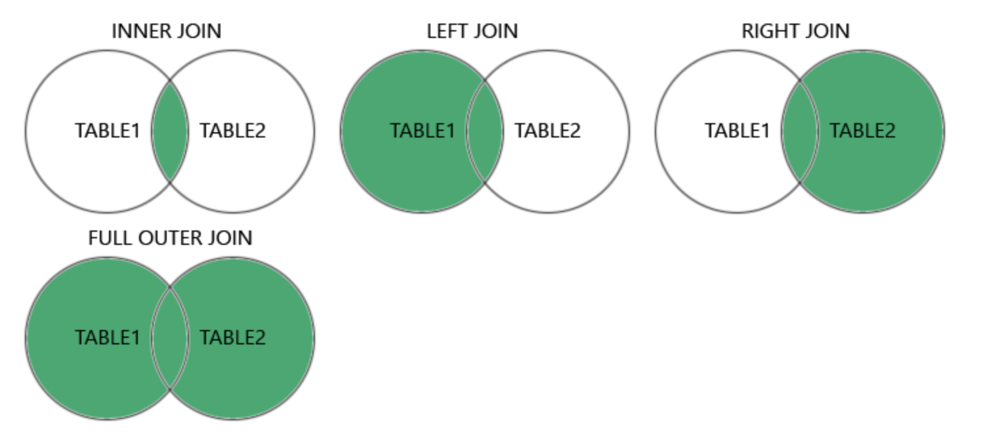

JOIN = INNER JOIN → chỉ lấy cái khớp.

LEFT JOIN → lấy hết bên trái, bên phải có thì thêm, không có thì NULL.

RIGHT JOIN → ngược lại với LEFT.

FULL OUTER JOIN → lấy hết cả 2 bên, khớp hoặc không khớp.

CROSS JOIN → tất cả kết hợp với tất cả.

SELF JOIN → join bảng với chính nó.

